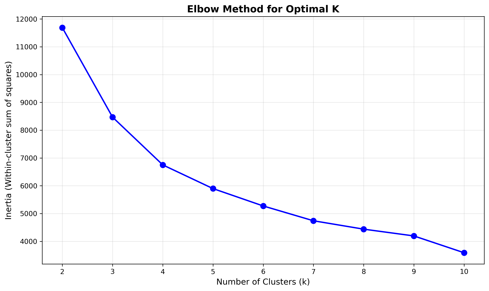
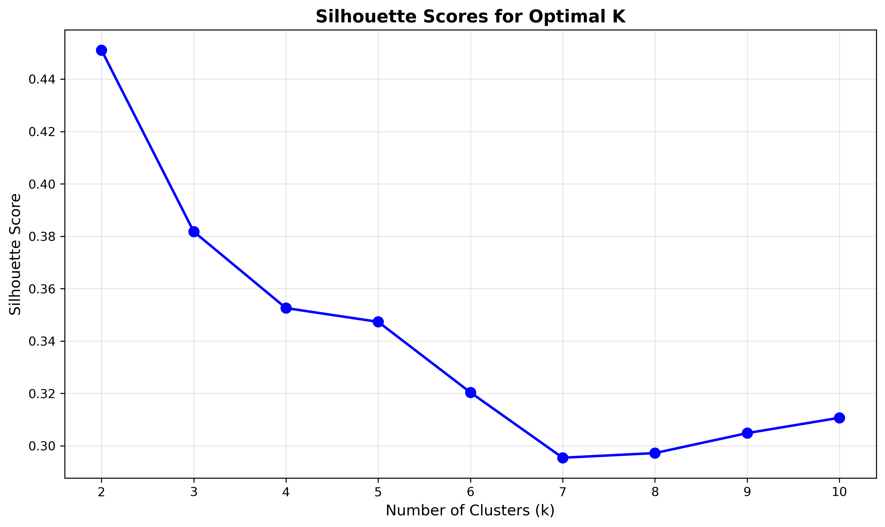
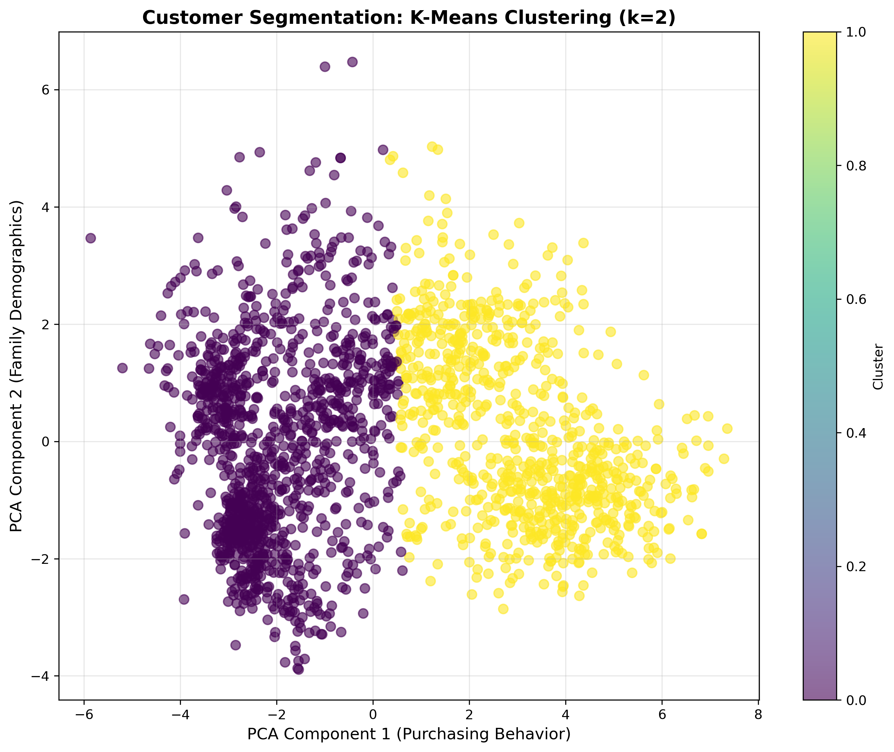
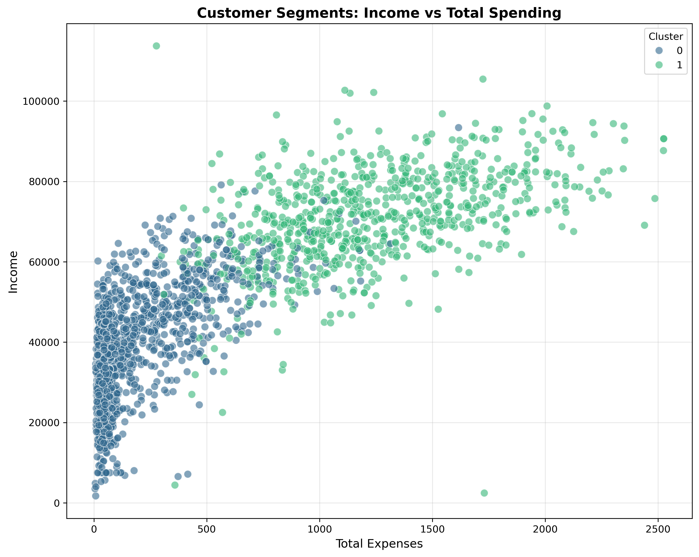

# Market Segmentation Analysis

## Project Summary
Developed an unsupervised learning system to segment customers for targeted marketing strategies using a marketing campaign dataset. Implemented multiple clustering algorithms (K-Means, Spectral Clustering, Agglomerative Clustering) with comprehensive evaluation metrics, identifying 3 distinct customer segments with optimal performance through systematic model comparison.

## Technical Approach

### Data Processing Pipeline
- **Data Source**: Marketing campaign dataset (2,240 customers, 29 features)
- **Preprocessing**: Handled missing values, removed outliers (Age <80, Income <150K), forward-filled gaps
- **Feature Engineering**: Created Age, Family_Size, Total_Expenses, and Kids features from raw data
- **Data Quality**: Reduced dataset from 2,240 to 2,006 customers after cleaning and deduplication

### Machine Learning Methodology
- **Dimensionality Reduction**: PCA with 3 components (explaining ~57% variance)
- **Clustering Algorithms**: K-Means, Spectral Clustering, Agglomerative Clustering
- **Model Selection**: Elbow method, Silhouette Score, and Dunn's Index for evaluation
- **Validation**: Compared 7 different clustering configurations (k=2,3,4 across algorithms)

## Results & Performance

### Optimal Model Selection
- **Best Model**: K-Means with 2 clusters
- **Silhouette Score**: 0.4511 (highest among all configurations)
- **Cluster Distribution**: 
  - Cluster 0: 1,217 customers (60.7%)
  - Cluster 1: 789 customers (39.3%)

### Model Comparison Results
- **K-Means (k=2)**: Silhouette Score 0.4511, Dunn's Index 0.0078
- **K-Means (k=3)**: Silhouette Score 0.3818, Dunn's Index 0.0111
- **K-Means (k=4)**: Silhouette Score 0.3526, Dunn's Index 0.0125
- **Spectral Clustering (k=2)**: Silhouette Score 0.4488, Dunn's Index 0.0179
- **Agglomerative Clustering (k=3)**: Silhouette Score 0.3602, Dunn's Index 0.0334 (best Dunn's Index)

### PCA Component Interpretation
- **PC1**: Captures purchasing behavior (Income, Wines, Meat, Catalog/Store Purchases)
- **PC2**: Reflects family demographics (Age, Kids, Family_Size, Teenhome, Deal Purchases)
- **PC3**: Represents lifestyle factors (Education, Marital_Status, health-conscious products)

### Key Insights
- **Product Preferences**: Wines category had highest total spending (610,538) across all customers
- **Segmentation Quality**: Clear separation between high-spending and moderate-spending customer groups
- **Business Value**: Two distinct segments enable targeted marketing strategies based on purchasing behavior and demographics

## Visualizations

### Optimal Cluster Selection

The elbow method plot shows the optimal number of clusters by analyzing the within-cluster sum of squares. The "elbow" point indicates where adding more clusters provides diminishing returns.

### Model Evaluation

Silhouette score comparison across different cluster numbers (k=2 to k=10). Higher scores indicate better-defined clusters, with k=2 achieving the optimal score of 0.4511.

### Customer Segmentation Results

2D visualization of customer segments using the first two PCA components. The plot shows clear separation between the two identified customer groups, demonstrating effective segmentation.

### Segment Characteristics

Income vs Total Spending scatter plot colored by cluster assignment. This visualization reveals distinct purchasing patterns between customer segments, enabling targeted marketing strategies.

## Project Impact
This project demonstrates proficiency in unsupervised learning, dimensionality reduction, and customer analytics. The systematic approach to algorithm comparison and evaluation showcases strong analytical thinking and technical implementation skills relevant to data science, marketing analytics, and business intelligence roles.
